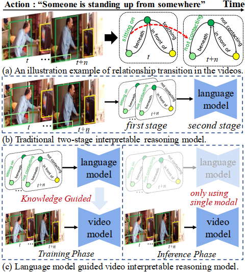
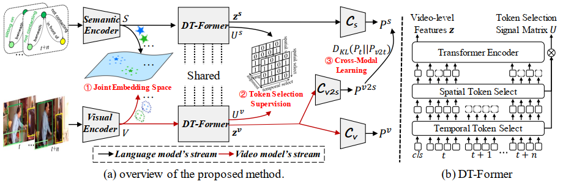
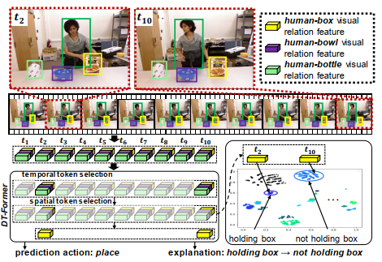

<div align="center">

## 🚀 **LaIAR**: Language Model Guided Interpretable Video Action Reasoning

<a href="https://pytorch.org/get-started/locally/"></a>
[](https://github.com/nku-shengzheliu/SER30K/blob/main/LICENSE)

</div>

This is the official repository of our paper **Language Model Guided Interpretable Video Action Reasoning**.

# 🏚️ Introduction


 (a) An example of action that can be decomposed into relationship transitions (i.e., when the transition is ‘sitting on’ → ‘not contacting’ between <person, bed> pair, it represents the action ”Someone is standing up from somewhere”.). 
 (b) Traditional two-stage methods usually predict the scene graph first, and then use language models to capture the semantic-level relationship transitions. 
 (c) Our method exploits a language model to guide the video model to capture the relationship transition during training. During inference, our method processes videos and directly recognizes actions, providing supportive evidence.

# 🏚️ Method


 Overview of our LaIAR. The architecture comprises a language model (top) which takes a video as input and a video model (bottom) which takes the scene graph sequence as input. Both models use DT-Former to capture key relational transitions to recognize actions. We transfer knowledge across modalities using a learning scheme (i.e., Joint Embedding Space, Token Selection Supervision and Cross-Modal Learning), which can help video model benefit from language model during training. For inference, only the video model is considered.

# 🏰 Visualizations


In the inference stage, we first extract the visual relation representations of human-object pairs in each frame. Then, our proposed DT-Former selects important relations in temporal and spatial dimensions and predicts action by modeling the important relation transition. Finally, the visual representations of important relations are mapped into the joint embedding space to find their nearest neighbor semantic labels, which can provide explicit evidence for the action reasoning process. In this example, the relation representations between the person and the box in the second and tenth frames are selected as cues for the action recognition. The nearest semantic labels of these two representations in the joint embedding space are ”holding box” and ”not holding box”, respectively. Here, the consequences of observations ‘holding’ → ‘not holding’ provide a clear sign of the action ”place”.

# Using Tools

## Set up environments
We run our experiments using Python 3.9.16. You can install the required packages using:

```
conda create --name dp-env python=3.9.16
conda activate dp-env
conda install --file requirements.yaml
```
